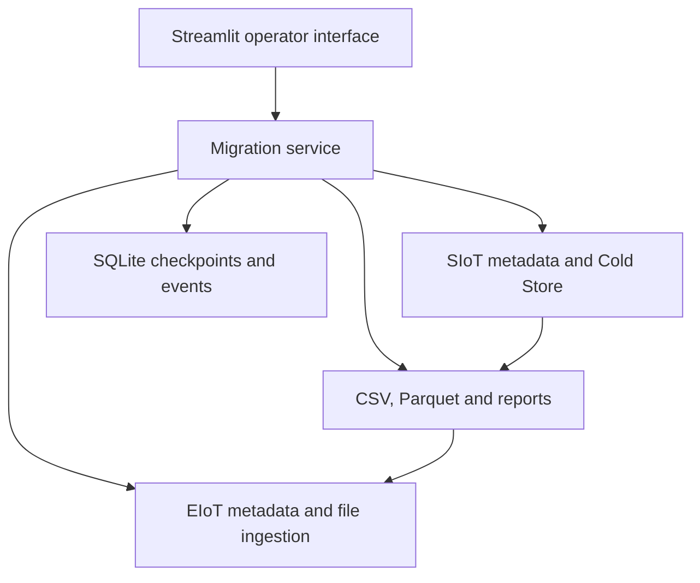

# Migration Studio — Handover Guide

This guide describes the supplied V5 code (`APP_VERSION = "5.0"`). Use the [README](../README.md) for local startup commands.

## Purpose and boundaries

The tool moves selected historical measurements from SIoT Cold Store to an existing EIoT target. It reads source and target metadata, prepares compatible Parquet files, and submits them to EIoT. It does not create target Technical Objects or indicators, fix their metadata, delete source history, or roll back data already uploaded.

A **Technical Object (TO)** identifies the equipment or functional location. A **position** locates an indicator on that object. A **characteristic** identifies the measurement. EIoT ingestion uses `managedObjectId` and `measuringNodeId`, which the tool obtains from target metadata.

The application is a local operator tool. There is no application login or separate approver identity check; approval buttons record an operator's acknowledgement. Keep approval evidence outside the app as well.

## Architecture and code ownership

| File | Responsibility |
| --- | --- |
| `app.py` | Six workflow tabs, selections, approval controls, downloads, and session-based status polling. |
| `src/config.py` | Loads `.env`, applies defaults, checks required settings, and resolves local storage paths. |
| `src/api.py` | OAuth, HTTP sessions, API requests, retries, archive downloads, and file uploads. |
| `src/migration.py` | Scope, discovery, extraction, mapping, transformation, validation, production, reporting, and cleanup. |
| `src/db.py` | SQLite schema, checkpoints, upload records, and activity events. Tables are created at startup. |
| `src/ui.py` | Styling, status labels, progress displays, and activity presentation. |
| `requirements.txt` | Streamlit, Requests, python-dotenv, pandas, PyArrow, and openpyxl. Versions have lower bounds, not a lockfile. |
| `.streamlit/config.toml` | Streamlit theme and toolbar configuration. |

## Configuration

Before the first migration, obtain working service credentials, tenant URLs, and any required network/VPN access from the SAP service owner. The source account needs metadata, export, status, and download access. The target account needs metadata, upload, and file-status access. Exact roles/scopes are tenant-specific and are not defined in this repository.

Copy [`.env.example`](../.env.example) to `.env` in the project root. Fill in these settings:

| Connection | Settings |
| --- | --- |
| Cold Store | `SIOT_COLD_STORE_CLIENT_ID`, `SIOT_COLD_STORE_CLIENT_SECRET`, `SIOT_COLD_STORE_TOKEN_URL`, `SIOT_COLD_STORE_BASE_URL` |
| Cold Store download host | `SIOT_COLD_STORE_DOWNLOAD_BASE_URL`; leave blank only when the export and download base URLs are the same. |
| Source metadata | `SIOT_INDICATOR_CLIENT_ID`, `SIOT_INDICATOR_CLIENT_SECRET`, `SIOT_INDICATOR_TOKEN_URL`, `SIOT_INDICATOR_API_KEY`, `SIOT_APM_BASE_URL` |
| Target metadata and ingestion | `EIOT_CLIENT_ID`, `EIOT_CLIENT_SECRET`, `EIOT_TOKEN_URL`, `EIOT_API_KEY`, `EIOT_APM_BASE_URL` |
| Token authentication | `SIOT_COLD_STORE_AUTH_STYLE`, `SIOT_INDICATOR_AUTH_STYLE`, `EIOT_AUTH_STYLE`: `form` by default, or `basic`. |

Token URLs are complete token endpoints. Base URLs are the service prefixes **before** the paths listed below; do not append those paths twice. Cold Store base URLs may include a service-specific prefix supplied by the service owner.

Set the two APM base URLs explicitly. If omitted or blank, the code falls back to `https://api-apm.prod.apimanagement.eu20.hana.ondemand.com`. Configuration validation checks for nonempty values only; it does not verify tenant selection, credentials, permissions, or connectivity.

Existing process environment variables take precedence over `.env`. Settings and clients are cached, so restart Streamlit after a configuration change. Keep the same source/target configuration throughout a run: tenant configuration is not saved with each run, and existing mappings are reused.

Legacy `P_SIOT_*`, `P_SIOT_INDICATOR_*`, and `P_EIOT_*` client/token variables remain supported. Source API-key fallbacks are `SIOT_API_KEY`, then `PROD_APM_API_KEY`; the target fallback is `PROD_APM_API_KEY`. New installations should use the canonical names in `.env.example`.

### Runtime defaults

These are application defaults, not statements of SAP service limits. Start with them and change only the settings needed for the workload.

| Setting | Default | Meaning |
| --- | --- | --- |
| `REQUEST_TIMEOUT_SECONDS` | `60` | HTTP request timeout; minimum 10 seconds. |
| `EXPORT_SLICE_DAYS` / `EXPORT_MIN_SLICE_DAYS` | `31` / `1` | Initial export range and adaptive split threshold. |
| `TRANSFORM_CHUNK_ROWS` | `150000` | CSV rows read per chunk; minimum 10,000. |
| `UPLOAD_MAX_ROWS` / `UPLOAD_MAX_MB` | `250000` / `30` | Production file row and compressed-size caps; MB uses 1,048,576 bytes. |
| `AUTO_POLL_SECONDS` / `AUTO_DOWNLOAD_READY` | `10` / `true` | Active-session polling interval (minimum 10 seconds) and automatic ready-export downloads. |
| `DOWNLOAD_CHUNK_MB` | `8` | Download streaming buffer. |
| `DISCOVERY_WORKERS` / `EXPORT_WORKERS` / `STATUS_WORKERS` | `12` / `8` / `16` | Concurrent discovery, export submissions, and status requests. |
| `DOWNLOAD_WORKERS` / `GZIP_WORKERS` | `4` / `4` | Concurrent archive downloads and decompression. |
| `MAPPING_WORKERS` / `TRANSFORM_WORKERS` / `PREPARE_WORKERS` / `UPLOAD_WORKERS` | `12` / `4` / `3` / `4` | Concurrent mapping, transformation, production preparation, and uploads. |
| `TRANSFORM_PARQUET_COMPRESSION` / `UPLOAD_PARQUET_COMPRESSION` | `snappy` / `gzip` | Intermediate and upload Parquet codecs. |
| `LARGE_SCOPE_TO_COUNT` / `LARGE_SCOPE_DAYS` / `LARGE_SCOPE_JOBS` | `100` / `31` / `100` | Scope warnings/risk display; these are not hard workload limits. |
| `MIGRATION_DATA_DIR` | `<project>/data` | Run files and default database location. |
| `MIGRATION_DB_PATH` | `<data directory>/migration.sqlite3` | SQLite checkpoint database. |

Relative path overrides resolve from the terminal's working directory. Lower worker counts if the tenant throttles requests or the machine runs short of memory. The app does not calculate required disk space; allow room for downloaded archives, extracted CSVs, transformed files, and upload copies.

## API reference

All calls originate from `src/api.py`. Braces below mark values inserted by the application.

| Base setting | Method and path | Request / result |
| --- | --- | --- |
| Each configured `*_TOKEN_URL` | `POST` to the complete URL | Form field `grant_type=client_credentials`; reads `access_token` and `expires_in`. |
| `SIOT_APM_BASE_URL` | `GET /IndicatorService/v1/Indicators` | Filters `technicalObject_number`; expands `characteristics,positionDetails`; reads the `value` array. |
| `SIOT_COLD_STORE_BASE_URL` | `POST /v1/InitiateDataExport/{indicator_group}?timerange={from}-{to}` | Group is the source `P_<position ID>`; both dates use `YYYY-MM-DD`. Reads `RequestId` or `requestId`; accepts HTTP 200, 202, or 208 with an ID. |
| `SIOT_COLD_STORE_BASE_URL` | `GET /v1/DataExportStatus?requestId={id}` | Reads `Status` or `status`; normalizes ready-for-download and no-data responses. |
| `SIOT_COLD_STORE_DOWNLOAD_BASE_URL` | `GET /v1/DownloadData('{id}')` | Downloads an archive; supports byte-range continuation when the server honours it. |
| `EIOT_APM_BASE_URL` | `GET /IndicatorService/v1/Indicators` | Fetches target indicators per TO with expanded characteristics and positions. |
| `EIOT_APM_BASE_URL` | `GET /EIoTMetadataSyncService/v1/TechnicalObjects(number='{number}',SSID='{ssid}',type='{type}')` | Uses `$expand=indicators`; reads object/indicator sync status, target IDs, data types, and units. |
| `EIOT_APM_BASE_URL` | `POST /FileUploadService/v1/upload` | Multipart field `file` contains the Parquet file; reads `fileId` and `uploadedTime`. Used for both validation and production. |
| `EIOT_APM_BASE_URL` | `GET /FileUploadService/v1/files/status('{fileId}')` | Reads processing status, description, record count, and processing end time. |

Metadata lookup normally expands all target indicators once per TO/SSID/type. If that request fails, it tries a filtered expansion using target position, category, and characteristic. `search_indicator()` is available in the client but the current migration workflow uses bulk lookup and local matching.

**Authentication:** All business API calls use `Authorization: Bearer <token>`. Source APM and EIoT calls also use `x-api-key`; Cold Store calls do not. With `form`, client credentials are in the token request body. With `basic`, they use HTTP Basic authentication. Tokens are cached in memory.

**Retries:** Regular API calls make up to three attempts for 401, 429, and server errors; 401 triggers token refresh. File uploads have their own three-attempt loop and reopen the file for each attempt. Token-request failures are not automatically retried. Downloads use `.part` files and up to five streaming/resume attempts. These retries do not provide exactly-once delivery: a lost upload response can leave a remote file without a locally recorded ID.

## Operator workflow

### 1. Define the scope and discover metadata

Choose **New migration**. Paste IDs separated by new lines, commas, or semicolons, or upload an Excel workbook. Duplicate IDs are removed; `E_` and `F_` prefixes are stripped.

For Excel, use `.xlsx` or `.xlsm` with one unambiguous column named `Object ID (APM)`, `Technical Object`, `Technical Object ID`, `Technical Object Number`, or `TO`. The header must be within the first eight rows. The first sheet/header with matching data is used; sheets are not combined. Check the ID preview carefully, especially leading zeros: the reader uses automatic type inference. Although the UI accepts `.xls`, its reader dependency is absent from `requirements.txt`; convert those files to `.xlsx`.

Select an inclusive date range. Acknowledgements are required for large scopes and intentional overlap with earlier local runs. Overlap checking examines this SQLite database only, not the EIoT target or another installation's history.

In **Scope**, click **Discover selected**. Review `discovery_issues.csv`. Extraction requires discovery status `COMPLETE` or `COMPLETE_WITH_ISSUES`; discovering only a subset can leave it blocked by pending TOs.

### 2. Extract historical data

Discovery plans one job per unique source position and date slice. In **Extraction**, choose the jobs and click **Start / retry selected**. Oversized initiation errors trigger smaller child date ranges automatically, down to the configured split threshold. Splitting is based on recognised error text and does not handle every possible server failure.

Keep **Live status refresh** enabled while monitoring. Ready exports download automatically when `AUTO_DOWNLOAD_READY=true`; this applies to all ready jobs in the run, regardless of the current table selection. Set it to `false` and restart if downloads must be selected manually, then use **Download selected ready**.

The app unpacks ZIP archives, expands nested GZIP files, and registers CSVs. `NO_DATA` is a finished job with no measurements, not an upload failure.

### 3. Map and transform

In **Transform**, select downloaded CSVs and click **Transform selected**. Transformation can start before all exports finish. Review `mapping_report.csv`, `skipped_mapping_report.csv`, and the transformation summary before continuing.

The target match is exact after trimming whitespace:

**Technical Object + Category + Characteristic Internal ID + Position Name**

Source and target SSIDs and position IDs may differ. The app resolves the target's own IDs after the logical match. It skips missing/ambiguous matches, reported non-`SYNCED` metadata, missing target IDs, and unsupported data types. Missing sync-status fields do not themselves cause rejection.

Successful mappings and deterministic skips are cached per run. Only entries labelled `Mapping API error:` are automatically reconsidered on later mapping attempts. Correcting target metadata does not automatically invalidate the saved mapping catalog.

### 4. Validate with the customer

In **Validation**, select successful transformed files and create a sample (default 10 target rows; UI range 1–1,000). The sample takes leading rows distributed across selected files; it is not random and may contain fewer rows than requested. Choose files that cover the important objects, positions, and data types.

Download the customer validation Excel/CSV, then click **Upload validation sample**. This writes to the configured EIoT environment. Wait for `Processed`, have the customer compare IDs, timestamps, and values in EIoT, then use **Record customer approval**. The app checks file-processing status; it does not read measurements back to compare them automatically.

After a validation file receives a `fileId`, the sample cannot be rebuilt through the UI. A failed upload can be retried, but changing the sample requires maintainer review or a carefully scoped new run.

### 5. Prepare and approve production

In **Production**, select successful transformed outputs and click **Prepare selected production files**. Files are split by row count and compressed size. Review `upload_manifest.csv`, including file count, row count, and intended coverage. Then use **Approve production load**.

Preparation can be rebuilt before a production file has a recorded remote `fileId`; rebuilding clears production approval. Treat any uncertain upload outcome as already submitted until reconciled. Once submission begins, finish the prepared scope before planning additional work.

Validation rows are **not removed** from production files. Establish the target tenant's behaviour for repeated measurement keys before starting; the code does not guarantee overwrite or deduplication in EIoT.

### 6. Upload, reconcile, and close

Select ready files and click **Upload selected**. The default batch is up to 10 files; the UI allows 1–100. A new batch is blocked while any recorded production `fileId` has a status other than `Processed` or `Processing Failed`. Batches are started manually.

For failed files, investigate the returned description, save the current audit report, and use **Retry selected failed**. This resets selected records to `READY`; click **Upload selected** to actually resend them. Retry clears their stored remote file IDs and increments the application attempt counter; prior remote IDs are not retained as a separate attempt history.

Before declaring the migration complete, confirm:

- Every prepared production file is `Processed`.
- Pending objects/jobs/files, discovery issues, no-data results, and skipped mappings have been reconciled with the agreed scope.
- The customer validation evidence and final reports have been saved.

`COMPLETE` and the final summary's `COMPLETED` describe the prepared production files. They can coexist with unselected source work or skipped mappings.

## Data format and transformation rules

| Source / rule | Target behaviour |
| --- | --- |
| Required CSV columns | `_TIME`, `TechnicalObject`, `Position`, `CategoryId`; measurement columns use `C_<characteristic ID>`. |
| `_TIME` | Interpreted as Unix milliseconds and converted to a UTC nanosecond timestamp named `_time`. Invalid timestamps are dropped. |
| Object selection | Only TOs in the run are retained. Source position/category/characteristic keys join to the saved mapping. |
| Numeric-like target types, including `BOOLEAN`/`BOOL` | Stored as Parquet `float64`; conversion failures become null. Textual boolean labels are not explicitly translated. |
| Target types containing `DATE` | Stored as Parquet `date32`; invalid values become null. |
| Other types | Skipped as unsupported. |
| Output identity | `managedObjectId` and `measuringNodeId` are strings; each row is keyed by these IDs plus `_time`. |
| Duplicate values inside a CSV chunk | Pivoting keeps the first value per key/characteristic. |
| Duplicate target keys across chunks of one CSV | Transformation fails. There is no equivalent check across separate CSVs, separate runs, or existing target data. |

There is no unit conversion or extra row-level date-range filter during transformation; the date range is requested from Cold Store. `mapped_measurements` counts matched non-null source values before timestamp/value conversion, while `target_rows` counts pivoted output rows. These counts are not expected to match one-to-one.

## Checkpoints, storage, and reports

SQLite stores run scope/approvals, per-TO discovery, extraction request IDs, per-CSV transformation state, upload IDs/statuses, and activity events. Files are stored as follows:

| Location under `data/` | Content |
| --- | --- |
| `migration.sqlite3` | Checkpoint database; uses SQLite write-ahead logging. |
| `runs/<run-id>/extracted/` | Downloaded archives and unpacked CSVs. |
| `runs/<run-id>/transformed/` | Intermediate Parquet files. |
| `runs/<run-id>/validation/` | Sample Parquet and `validation_preview.csv`. |
| `runs/<run-id>/ready/` | Prepared production Parquet chunks. |
| `runs/<run-id>/reports/` | Mapping, transformation, load, and summary reports. |

| Report | What it proves or explains |
| --- | --- |
| `discovery_report.csv`, `discovery_issues.csv` | Discovered indicators and source metadata problems. |
| `mapping_report.csv`, `skipped_mapping_report.csv` | Target mappings and combinations not migrated. `mapping_catalog*.csv` are the reusable caches. |
| `transformation_summary.csv`, `transformation_overall.json` | Per-file results and aggregate transformation counts. |
| Customer validation Excel/CSV | Sample values, timestamps, object/position/characteristic details, and target IDs. Excel is generated for download. |
| `upload_manifest.csv` | Prepared file names, source files, rows, and sizes. |
| `successfully_migrated.csv`, `failed_uploads.csv`, `load_report.csv` | File-level ingestion results and the current upload audit; these are not row-by-row verification reports. |
| `final_migration_summary.json` | Requested scope and aggregate production outcomes. |
| Downloaded checkpoint snapshot | Current scope, statuses, metrics, and approval flags; informational only, with no restore/import feature. |

**Resume:** Start the app with the same data directory, database, file paths, and tenant configuration. Select the existing migration and use **Resume migration** if paused. Completed checkpoints remain available; retry eligible unfinished items. Progress persistence does not mean that a terminated local task restarts automatically.

**Pause:** Suspends polling and most new work. It does not cancel submitted SAP jobs or reliably interrupt an already running local action. Polling uses a Streamlit session, not an independent background worker; reopen the run or refresh statuses after closing the browser/app.

**Backup/move:** Stop the app after current local work finishes and copy the complete data directory plus any database stored elsewhere. Preserve SQLite sidecar files if present. Active records contain absolute file paths; moving to a different path or operating system requires a maintainer to reconcile those paths. A snapshot JSON alone cannot restore a run.

**Cleanup:** After production is `COMPLETE`, **Clean temporary files** removes extracted, transformed, validation, ready, and report-parts contents. It retains top-level reports and SQLite history. Download the customer validation report **before** cleanup, because its underlying preview is deleted.

**Abort & delete:** Permanently removes the local run records and its whole run folder, including reports. It cannot cancel remote exports or undo EIoT ingestion, and it removes that run from future local overlap checks.

## Troubleshooting and maintainer notes

| Symptom | Action |
| --- | --- |
| Missing module / wrong interpreter | Run the README installation command and launch with that same `.venv` Python. |
| “Configuration needs attention” | Fill the listed settings in root `.env`, check process environment overrides, and restart. |
| Port 8501 is occupied | Append `--server.port 8502` to the start command, then open `http://localhost:8502`. |
| 401 / 403 or connection failure | Check the relevant token URL, client credentials, auth style, API key, service permissions, and network access. Configured settings alone do not establish a connection. |
| 429 / repeated timeouts | Reduce the relevant worker counts or adjust request timeout, restart, then retry only affected work. |
| No valid target mapping | Inspect skipped mappings; correct the exact logical keys, sync status, data type, or missing target IDs with the tenant owner. Cached deterministic skips need maintainer invalidation before retry. |
| `Processing Failed` | Read the EIoT description and correct the cause. Save the audit, then retry selected failed files. |
| Accepted upload remains active | Refresh EIoT status using its recorded file ID. Unknown intermediate statuses deliberately block the next batch. Do not resend solely because processing is slow. |
| Upload timed out and no file ID was recorded | Reconcile with the EIoT service owner before retrying; the remote request may have succeeded. |
| Transformation stuck at `RUNNING` after a crash | No automatic stale-job reset exists. With the app stopped and database backed up, a maintainer must inspect the affected item and reset its status to `FAILED` before a UI retry. |
| Extraction retry does nothing for `Failed`, `Exception`, or `Expired` | The UI offers these rows, but `start_extraction()` starts only `PLANNED` or uppercase `FAILED`. A maintainer must reconcile the old request and normalize the affected status or fix the retry filter. |
| Mapping changes are not picked up | Existing successful mappings and deterministic skips are reused. Before uploads, a maintainer must invalidate only the affected cache/output state; there is no supported refresh-mapping button. |
| Missing local CSV/Parquet | Restore the matching files and database from backup. Avoid creating a replacement run until existing remote submissions are reconciled. |

Two further implementation limits matter when maintaining this version:

- IndicatorService responses are read from one `value` array; OData continuation links are not followed. Confirm expected indicator counts for large objects, or implement pagination before relying on paged results.
- Approvals apply to the run and are not bound to a hash of the final scope. Finish and review the intended transformation scope before customer approval; later additions need renewed operational review.

Use one operator/app instance per data directory to avoid competing actions. Keep credentials out of Git and control access to local exports, reports, and backups. Before pushing, use `git status --short` and check that `.env`, `.venv/`, and `data/` are not staged; ignore rules do not remove files already tracked.

### Acceptance check for the receiving team

On the intended machine, confirm the README startup commands, then use an agreed small TO/date scope to verify discovery, export, mapping, and report generation. With permission for real target writes, verify sample processing, customer approval, production processing, and restart recovery. Record the working Python/dependency versions and tenant configuration reference without secrets.

This documentation was checked against the supplied source. Live SAP calls and an end-to-end migration were not executed as part of preparing it. The supplied project has no automated test suite or pinned dependency lockfile.
